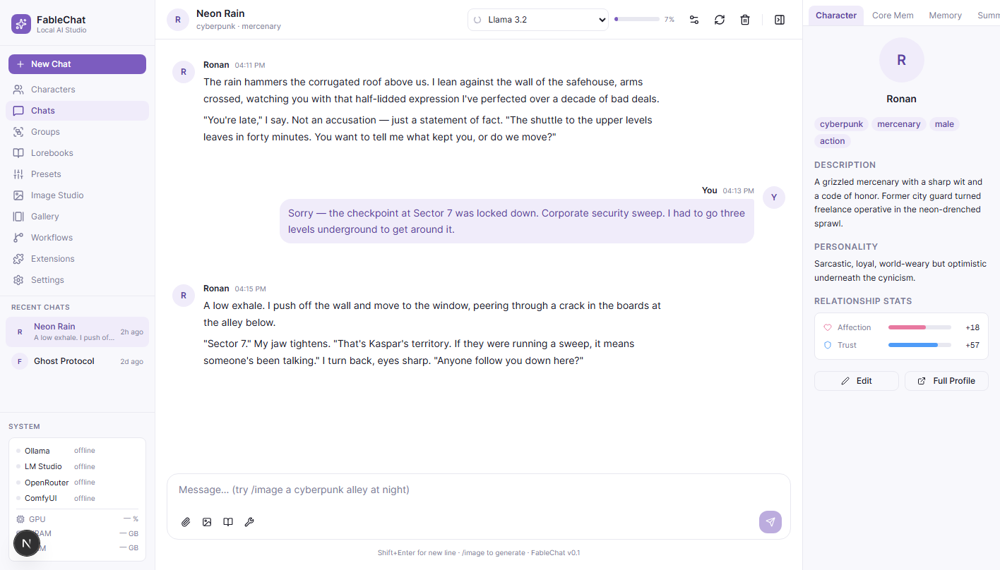
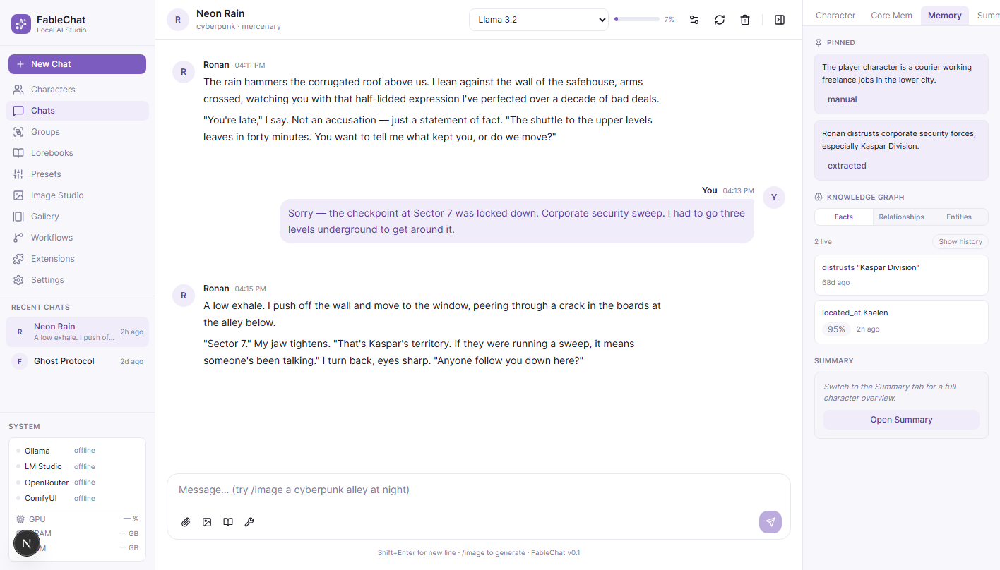
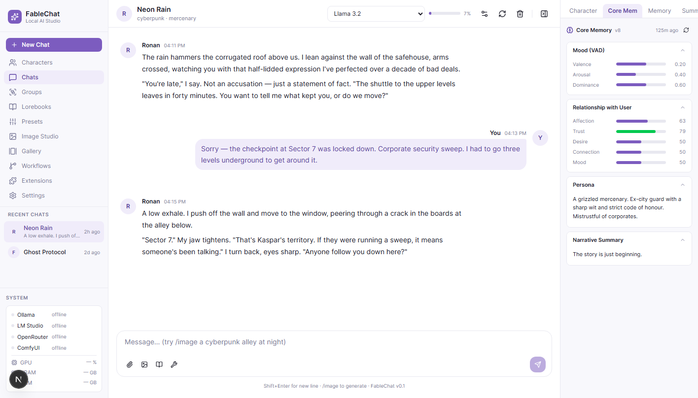
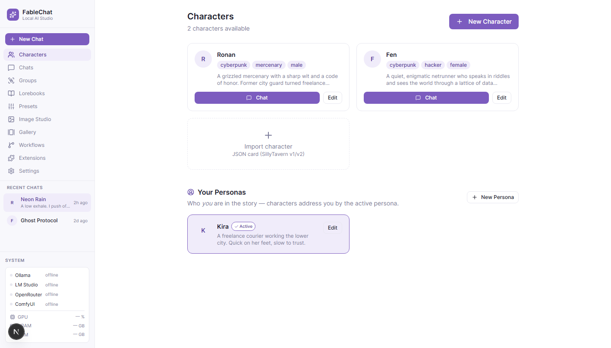
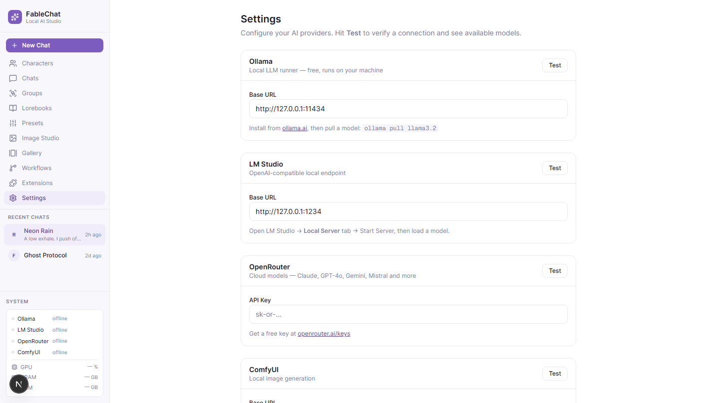

# CharacterBinderChat

**A local-first AI roleplay studio.** CharacterBinderChat (FableChat) is a Next.js app for deep, persistent, character-driven conversations with local or cloud LLMs — with a two-layer memory system that keeps the AI aware of everything that has happened in your story.



---

## What it is

Most AI chat apps forget everything the moment the context window fills up. CharacterBinderChat doesn't. It layers two complementary memory systems on top of any LLM:

- **Drawer 1 — Core Memory Block** (always in context): the character's current mood, emotional state, relationship with you, active commitments, internal thoughts, and a running narrative summary. Rewritten by the LLM after every exchange.
- **Drawer 2 — Bi-temporal Knowledge Graph** (retrieved): a SQLite graph of facts, entities, and relationship stats extracted from every conversation. Facts carry story-time and wall-time timestamps, so old beliefs are superseded rather than overwritten — you can ask "what did they believe *before* that happened?"

The result: characters that remember, grow, and stay consistent over hundreds of messages.

---

## Features

| Area | What's wired |
|------|-------------|
| **Chat** | Real streaming from Ollama, LM Studio, or OpenRouter. Stop mid-generation, regenerate, retry after a failure. |
| **Characters** | Full CRUD — create, edit, delete. Import SillyTavern v1/v2 JSON cards or **CharacterBinder PNG cards** — drop a PNG anywhere in the window and it routes by embedded type (character, lorebook, persona, scenario). The card art becomes the avatar. |
| **Personas** | Your identity in the roleplay. The active persona is injected into the prompt, labels your turns during extraction, and names the `player` entity in the graph. |
| **Groups + witness memory** | Multi-character scenes. Pick who replies (or auto by name-mention/round-robin), toggle who is present from the header — and each character only remembers what happened while they were in the scene. Talk about someone while they're away, and they genuinely don't know. Per-member memory inspector. |
| **Core Memory (Drawer 1)** | Per-character JSON document: mood (valence/arousal/dominance), 5-axis relationship stats, commitments, emotional events, internal thoughts, narrative summary. |
| **Knowledge Graph (Drawer 2)** | Bi-temporal SQLite graph. Entities, facts with supersession + semantic dedupe, relationship stat axes (affection / trust / desire / connection), commitments, episodic scene cards, reflections, shared-language "bits" (running jokes, nicknames), and a story clock. Auto-extracted after each message. Semantic retrieval via local Ollama embeddings, with a lexical fallback when Ollama is offline. |
| **Emotional dynamics** | Stats move non-linearly: headroom scaling near extremes, loss aversion on trust/affection drops, mood blending, and post-rupture inertia — a betrayal opens a refractory window where warmth recovers slowly and the wound stays in the prompt. |
| **Lorebooks** | Full editor: books, entries with comma-separated keywords, priorities, always-on (pinned) entries. Keyword-triggered injection as `[World Lore]` on every generation, with a token budget. |
| **Inspector Panel** | Right-side panel: Character · Core Mem · Memory · Web (mind-map graph) · Summary · Lore · Image Studio. The Memory tab has Facts (with history), Relationships, and Entities (with duplicate detection + merge). Every reply has a 🧠 provenance view showing exactly which memory shaped it. |
| **Model Selector** | Live model list from every connected provider, grouped by provider. Any model ID can be entered by hand — see [Choosing a model](#choosing-a-model). |
| **Persistence** | Chats, characters, and personas live in SQLite and survive clearing browser storage. One-click JSON export. |
| **Chat management** | Rename, delete, clear. Relative timestamps and last-message previews in the sidebar. |
| **System Status** | Sidebar shows real-time connection status + loaded model per provider. |
| **Image Generation** | `/image <prompt>` renders real images through your local ComfyUI — no launch flags needed, FableChat proxies the connection server-side. Workflow templates live in `workflows/*.json` (API format with a `_meta.fablechat` node mapping). Per-chat generation settings (temperature / top-p / max tokens) live behind the gear icon in the chat header. |

<details>
<summary><strong>More screenshots</strong></summary>

**Knowledge graph — extracted facts with supersession history**



**Core Memory — the always-in-context character state**



**Characters and personas**



**Provider settings**



</details>

---

## Tech stack

- **Frontend**: Next.js 16 (App Router, Turbopack), React 19, Tailwind CSS 4, Zustand
- **Database**: `better-sqlite3` — synchronous SQLite, zero config, runs in the Next.js server process
- **Providers**: Ollama · LM Studio · OpenRouter (OpenAI-compatible) · ComfyUI
- **Memory**: Custom bi-temporal schema + Core Memory JSON document

---

## Getting started

### Prerequisites

- Node.js 20.9+ (required by Next.js 16)
- At least one LLM provider:
  - [Ollama](https://ollama.ai) (default: `http://127.0.0.1:11434`)
  - [LM Studio](https://lmstudio.ai) (default: `http://127.0.0.1:1234`)
  - Or an [OpenRouter](https://openrouter.ai) API key

### Install & run

```bash
git clone https://github.com/Fablestarexpanse/CharacterBinderChat.git
cd CharacterBinderChat
npm install
npm run dev
```

Open [http://localhost:3000](http://localhost:3000).

The SQLite database is created automatically at `data/fablestore.db` on first run, and column upgrades apply when an older database is opened.

### Configuration

All provider settings are in the **Settings** panel inside the app — no `.env` required for local providers. For OpenRouter, paste your API key in Settings → OpenRouter.

Optional env vars:

```env
FABLE_DB_PATH=/path/to/your/fablestore.db   # custom DB location
```

---

## Choosing a model

The dropdown in the chat header lists every model each connected provider reports — for OpenRouter that's the full catalogue (hundreds of models), sorted by ID. Native `<select>` type-ahead works: focus it and start typing `deepseek` to jump straight there.

To use a model that isn't listed — a brand-new release, a private deployment, or a self-hosted tag — pick **＋ Custom model ID…** at the bottom of the dropdown and enter the ID exactly as the provider names it:

| Provider | ID format | Example |
|---|---|---|
| OpenRouter | `vendor/model` | `deepseek/deepseek-v3.2-exp` |
| Ollama | `name:tag` | `llama3.2:latest` |
| LM Studio | whatever `/v1/models` reports | `local-model` |

Custom IDs are saved and appear in the dropdown from then on. Copy OpenRouter slugs from [openrouter.ai/models](https://openrouter.ai/models).

---

## Personas

A **persona** is who *you* are in the story — the mirror image of a character. Create one under **Characters → Your Personas**, then click its card to make it active.

The active persona does three things:

1. Adds a `[User Persona]` block to the system prompt, so the character addresses you by name instead of "user"
2. Labels your turns during memory extraction, so extracted facts are about *you*, not "the user"
3. Renames the `player` entity in the knowledge graph to match

Personas are global, not per-chat.

---

## Project layout

```
fablechat/
├── app/
│   ├── api/
│   │   ├── chat/core-memory/     # Drawer 1 CRUD + LLM refresh
│   │   ├── drawer/               # Drawer 2: entities, facts, stats, extract
│   │   └── state/                # Durable chats/characters/personas + export
│   └── page.tsx
├── components/
│   ├── characters/               # CharacterEditorDialog, PersonaEditorDialog
│   ├── chat/                     # ChatHeader, ChatInput, MessageItem
│   ├── inspector/                # CharacterTab, CoreMemoryTab, MemoryTab…
│   │   ├── graph/                # MemoryGraph — the story-web canvas
│   │   └── memory/               # Facts, Relationships, Entities sub-views
│   ├── sections/                 # One screen per sidebar entry
│   ├── sidebar/                  # Sidebar, SystemStatus
│   ├── ui/                       # Hand-rolled primitives (dialog is the one Radix wrapper)
│   └── StateSync.tsx             # Hydrate from SQLite, mirror edits back
├── lib/
│   ├── api/                      # server.ts (routeError, envelope validator) + client.ts (getJson)
│   ├── chat/                     # generation, promptBuilder, tokenBudget — client-safe
│   ├── server/                   # memoryExtractor, memoryRewriter, retrieval, coreMemory — SQLite-side
│   ├── db/                       # FableStore (better-sqlite3), schema, models, rows, predicates
│   ├── hooks/                    # useHydrated, useModelCatalog, useInspectedCharacter
│   ├── import/                   # CharacterBinder / SillyTavern card parsing
│   ├── llm/                      # Shared LLM transport, JSON parsing, embeddings
│   ├── providers/                # Ollama, LMStudio, OpenRouter, ComfyUI adapters
│   ├── store/                    # Zustand client store (slices) + ui.ts (transient)
│   ├── text/                     # Lexical overlap — the no-embeddings fallback
│   ├── types.ts                  # Shared wire and domain types
│   └── utils.ts                  # cn, downloads, time formatting, forbidden words
└── data/
    └── fablestore.db             # auto-created SQLite database
```

---

## How the memory system works

```
User sends message
       │
       ▼
 fetchCoreMemory()          ← GET /api/chat/core-memory
       │
       ▼
 buildSystemPrompt()        ← character + persona + mood + relationship + facts
       │
       ▼
 fitHistoryToBudget()       ← trims oldest turns to the model's context window
       │
       ▼
 provider.streamChat()      ← Ollama / LM Studio / OpenRouter (abortable)
       │
       ▼
 Response streams in        ← updateMessageContent() per token
       │
       ▼
 [parallel after complete]
  ├── /api/drawer/extract            ← Drawer 2: entities/facts/stats → SQLite,
  │                                    then syncs stats into Core Memory
  └── /api/chat/core-memory/refresh  ← Drawer 1: rewrites mood/persona/narrative
```

Extraction failures are surfaced, not swallowed: if the model returns unparseable JSON the route responds `502` and the Memory tab shows what went wrong.

### Data & backups

Chats, characters, and personas are written to SQLite a moment after every change, and the app hydrates from the database on load — so clearing browser storage doesn't lose anything. **Settings → Your Data → Export** downloads everything as JSON.

`data/fablestore.db` is the single file worth backing up.

---

## Status

Working end to end: chat + streaming, both memory drawers (with embeddings, episodic memory, shared language, story clock, and reply provenance), characters, personas, PNG/JSON card import, lorebooks with keyword injection, real ComfyUI image generation, per-chat generation settings, persistence, chat management, the model selector, the memory inspector, and the story-web mind map.

Every sidebar section is a working screen: Characters, Chats, Groups, Lorebooks, Scenarios, Presets, Image Studio, Gallery, Workflows and Settings.

Not yet built:

- **Some image-studio controls are decorative**: the LoRA stack, ControlNet, refiner, aspect-ratio and character-reference controls don't reach the workflow yet — prompt, dimensions, steps, CFG, sampler, seed and batch do.
- **The OpenRouter API key is stored in browser localStorage** and used directly from the client. Fine for a single-user local app; a server-side proxy would be better.

---

## Roadmap

- [x] Character creation UI
- [x] User personas
- [x] Durable chat storage + export
- [x] Chat rename / delete / clear / regenerate
- [x] Custom model IDs
- [x] Real ComfyUI image generation
- [x] Lorebook editor + keyword injection
- [x] Per-chat generation settings
- [x] PNG card import (CharacterBinder / SillyTavern)
- [x] Group chats with witness-scoped memory
- [ ] GPU / VRAM monitoring
- [ ] Export chat as story document
- [ ] Mobile layout

---

## Development

```bash
npm run dev        # Turbopack dev server
npm run build      # production build
npm run lint       # ESLint
npm run typecheck  # tsc --noEmit
npm test           # 60 unit tests (node --test, no server, no API key)
```

Those four run on every push (`.github/workflows/ci.yml`).

Two suites need more than a checkout, so they stay manual:

```bash
FABLE_TEST_URL=http://localhost:3001 npm run test:api   # route contracts + bi-temporal invariants, against a running server
npm run eval                                            # scripted scenarios through a real model (costs money)
```

`npm test` loads the app's own `.ts` modules through Node's type stripping — no build step and no test-only bundle, so nothing can pass there while the app fails. A small resolve hook (`tests/unit/loader.mjs`) teaches Node the `@/` alias and extensionless imports, so the suite reaches FableStore and retrieval as well as the pure modules.

The Python reference implementation of Drawer 2 — including a 77-test pytest suite that documents the intended bi-temporal semantics — lives in `../fable_drawer2/`. `tests/unit/schema.test.mjs` and `tests/api/bitemporal.test.mjs` assert the parts of that spec the TypeScript port must honour.

---

## License

MIT
